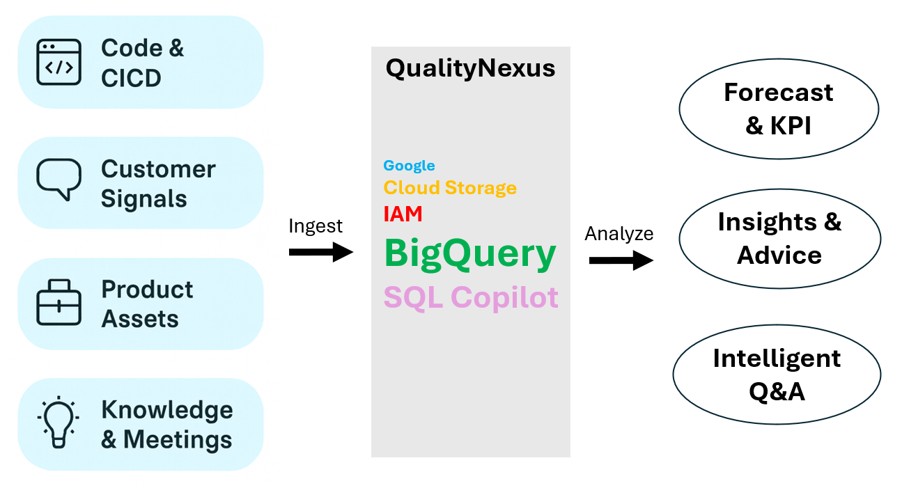
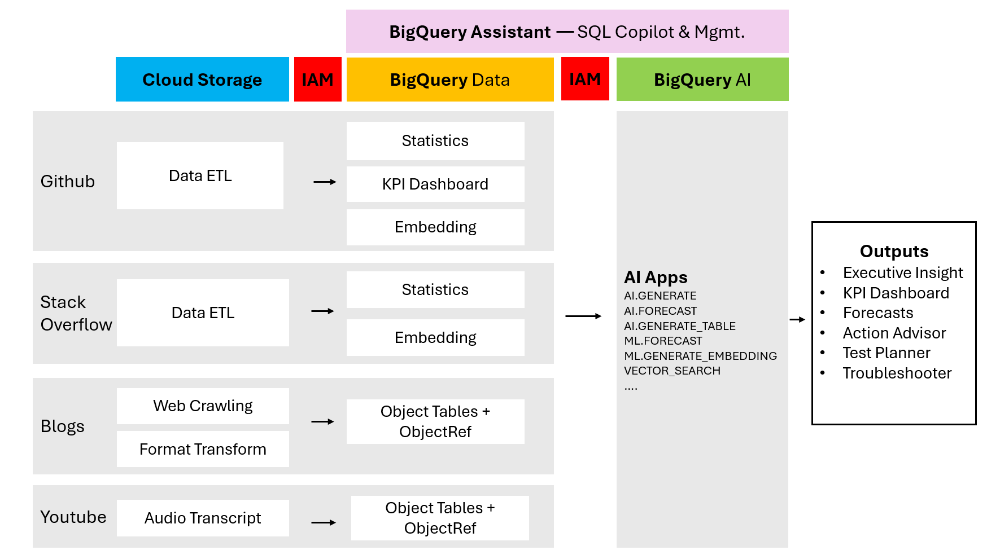
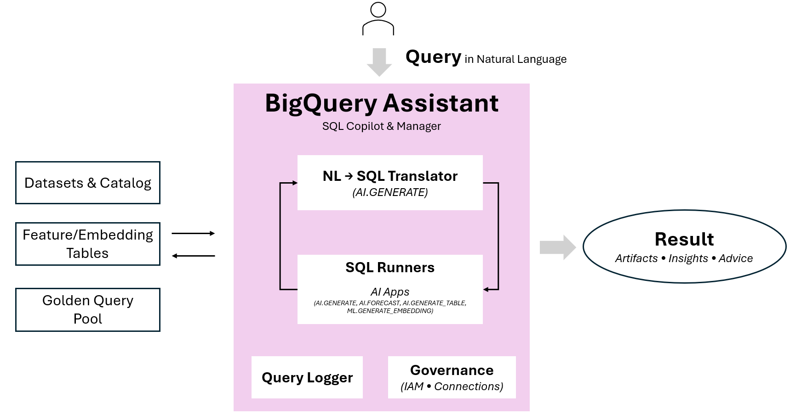

# QualityNexus:Multimodal DevOps Quality Intelligence 
— Built on BigQuery

# Problem Statement
Software engineering organizations lack a trustworthy, timely view of release health because signals live everywhere—code/CI, issue trackers, customer Q&A, release PDFs, and even meeting recordings. In the AI era, coding velocity rises while verification lags, making testing reactive and risk discovery late. At the same time, creating/adapting/maintaining SQL in BigQuery that stitches these sources is hard: queries are schema-coupled, scattered, and rarely reusable.

# What is QualityNexus
The QualityNexus turns BigQuery into a multimodal quality plane and adds a BigQuery Assistant for natural-language driven analytics. It’s a reproducible reference system that:
- Ingest structured and unstructured signals (GitHub, Stack Overflow, Blogs, PDFs, audio, images) into BigQuery (Standard tables + Object Tables).
- Enrich with AI: transcription, summarization, and ML.GENERATE_EMBEDDING for semantic search.
- Retrieve & reason with a RAG Test Advisor that grounds test planning on the latest changes and docs, additionally a troubleshoot advice on the historical code changes and documents.
- Forecast near-term activity with ML.FORECAST / AI.FORECAST.
- Assist analysts/engineers with a Natural Language → SQL copilot that automatically generate, executes, summarizes, and logs queries for reuse/governance.
- Ships as a portable notebook: all steps (ingest → embed → analyze → generate)

# Innovation - BigQuery Assistant , a Natual Langurage to SQL copilot :
- Turns questions like “Summarize Lead Time for Changes in 2019” into runnable SQL, which further invoke BigQuery AI.apps.
- Executes, summarizes, and returns artifacts
- Logs (dataset, table, question, SQL, summary, timestamp) into a governance query repository table for reuse & audits

# Data sources (Kubernetes 2019 demo):
- GitHub Archive (dev/test activity, ~300K events)
- Stack Overflow (community questions, ~9K)
- Release PDFs (Kubernetes Blog, 52 docs)
- YouTube sessions (team talks / intros)
- KPI chart images generated in-notebook

# Key BigQuery features:
- ML.FORECAST / AI.FORECAST for short-term projections
- AI.GENERATE for executive summaries & a RAG-style Test Advisor
- ML.GENERATE_EMBEDDING for semantic retrieval across PDFs, transcripts, and GitHub text
- VECTOR_SEARCH over embeddings, unifying multi-corpus hits (Docs/GitHub), providing troubleshooting guide.
- Object Tables + ObjectRef (GCS) for PDFs, audio, and KPI images
- AI.GENERATE_TABLE for audio transcription & image to insight.

# Deliverables (all reproducible in one notebook):
- Forecasts for GitHub events & issues (next quarter)
- Quarterly executive insights from both stats and sentiment
- Unified Retrieval & Troubleshooting Guide - RAG over Embeddings
- Multimodal insights from KPI images and YouTube audio (Object Tables)
- RAG Test Advisor that proposes focused test areas and cases using embeddings over GitHub+PDF+YouTube

# Governance & Security
- IAM scoped BigQuery for Connection access to Vertex AI and ObjectRef access to GCS.
- Re-runnable SQL assets (CREATE TABLE/MODEL) and dataset-scoped logging.
- Extensible to new sources/models without architectural changes.

# Industry framing
Google DORA-State of DevOps and SPACE framework highlight the value of trustworthy, end-to-end quality signals.

# Reflection
Google BigQuery, together with Cloud Storage, IAM and Vertex AI, enables an efficient, end-to-end AI development workflow, scaling usage from individual experiments to production. Using Kubernetes (2019) public data, we highlighted:
- Effective data ingestion & retrieval via Cloud Storage and Object Tables
- Governed access to data & Vertex AI (models, and AI apps) via IAM
- Flexible analytics in BigQuery: statistical, text, vector and multimodal workloads.
